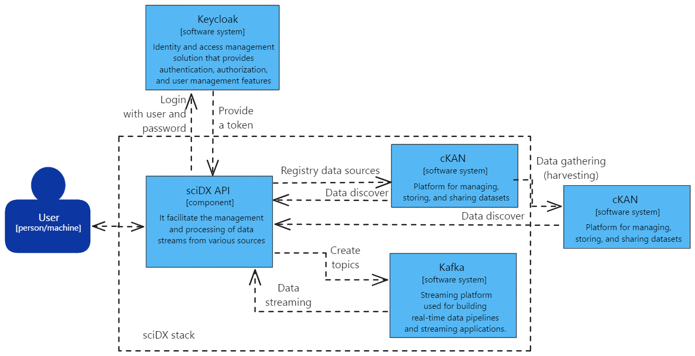

# sciDX API

sciDX API is a RESTful API built with FastAPI that plays a crucial role in the sciDX stack. This project is designed to facilitate the management and processing of data streams from various sources, integrating services like CKAN and Keycloak for authentication, authorization, and data handling.

## What is sciDX API?

The sciDX API is a key component within the sciDX ecosystem, a platform designed to manage and process scientific data efficiently and securely. The API enables:

- **Data Stream Management**: Processes and manages real-time data using Kafka.
- **CKAN Integration**: Facilitates the integration and manipulation of datasets in CKAN.
- **Authentication and Authorization**: Implements access control using Keycloak.
- **URL Handling and Data Streaming**: Manages data ingestion, updating, and processing through URLs and streaming services.

### Architecture Diagram

## Use Cases

### 1. Real-Time Data Processing
The API enables the publishing and consumption of messages via Kafka, facilitating real-time data processing in a distributed environment.

### 2. CKAN Dataset Management
sciDX API integrates with CKAN to create, update, and delete datasets, ensuring that scientific data is accessible and efficiently managed.

### 3. Secure Authentication
Using Keycloak, the API manages user authentication and authorization, providing robust access control.

### 4. URL Ingestion and Management
The API supports data ingestion through URLs, allowing for dynamic management and updating of external data sources.

## Installation

For detailed instructions on installing, configuring, and accessing the sciDX API, please see the [Installation Guide](docs/installation.md).

## Contributing

Contributions are welcome. Please review our [Contributing Guide](docs/contributing.md) for more details.

## Testing

All tests are designed to run with *pytest*. Before submitting new contributions, please ensure that all existing tests pass successfully. Additionally, for any new features or functionalities introduced, create appropriate tests without modifying the existing ones. This helps maintain the integrity and reliability of the API.

## License

This project is licensed under the [MIT License](LICENSE).
