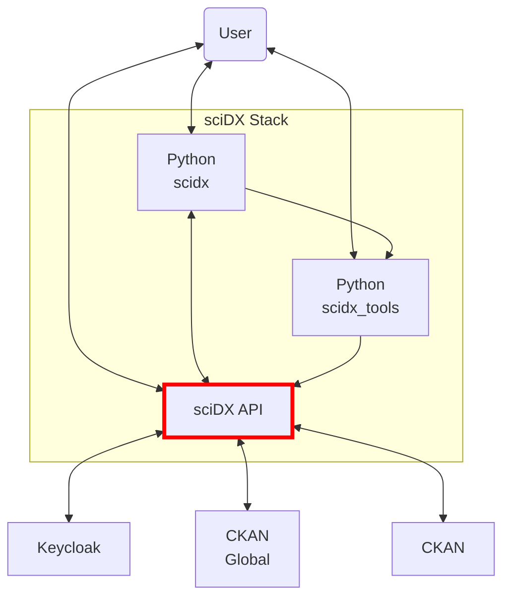

# sciDX API

sciDX API is a RESTful API built with FastAPI that plays a crucial role in the sciDX stack. This project is designed to facilitate the management and processing of data streams from various sources, integrating services like CKAN and Keycloak for authentication, authorization, and data handling.

## What is sciDX API?

The sciDX API is a key component within the sciDX ecosystem, a platform designed to manage and process scientific data efficiently and securely. The API enables:

- **Data Stream Management**: Processes and manages real-time data using Kafka.
- **CKAN Integration**: Facilitates the integration and manipulation of datasets in CKAN.
- **Authentication and Authorization**: Implements access control using Keycloak.
- **URL Handling and Data Streaming**: Manages data ingestion, updating, and processing through URLs and streaming services.

### Architecture Diagram



## Use Cases

### 1. Real-Time Data Processing
The API enables the publishing and consumption of messages via Kafka, facilitating real-time data processing in a distributed environment.

### 2. CKAN Dataset Management
sciDX API integrates with CKAN to create, update, and delete datasets, ensuring that scientific data is accessible and efficiently managed.

### 3. Secure Authentication
Using Keycloak, the API manages user authentication and authorization, providing robust access control.

### 4. URL Ingestion and Management
The API supports data ingestion through URLs, allowing for dynamic management and updating of external data sources.

## Usage Example

Here’s a basic example of how to interact with the sciDX API using `curl`:

```bash
# Authenticate with Keycloak and obtain a token
curl -X POST "https://your-auth-server/token" -d 'client_id=your-client-id&client_secret=your-client-secret&grant_type=client_credentials'

# Submit a dataset to CKAN via the API
curl -X POST "https://your-api-server/api/datasets" -H "Authorization: Bearer your-token" -d '{"name": "example-dataset", "url": "https://example.com/data.csv"}'
```

## Documentation

For more details on installing, configuring, and using the sciDX API, refer to the following documents:

- [Installation](docs/installation.md)
- [Configuration](docs/configuration.md)
- [Usage](docs/usage.md)
- [Testing](docs/testing.md)
- [Contributing](docs/contributing.md)

## Contributing

Contributions are welcome. Please review our [Contributing Guide](docs/contributing.md) for more details.

## License

This project is licensed under the [MIT License](LICENSE).
