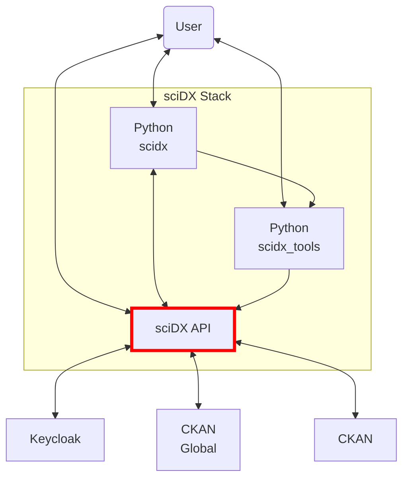

```mermaid

flowchart TD

    %% Define styles for better visibility

    classDef redStroke stroke:#ff0000,stroke-width:4px;


    %% Define the main elements

    user(User)

    python1[Python <br/> scidx]

    python2[Python <br/> scidx_tools]

    scidx_api[sciDX API]

    keycloak[Keycloak]

    ckan1[CKAN <br/> Global]

    ckan2[CKAN]


    %% Define the connections

    user <--> python1

    user <--> python2

    user <--> scidx_api

    python1 --> python2

    python1 <--> scidx_api

    python2 --> scidx_api

    scidx_api <--> keycloak

    scidx_api <--> ckan1

    scidx_api <--> ckan2


    %% Group related nodes in a subgraph

    subgraph sciDX Stack

        direction TB

        python1

        python2

        scidx_api

    end


    %% Apply styles to specific nodes

    class scidx_api redStroke;

```
